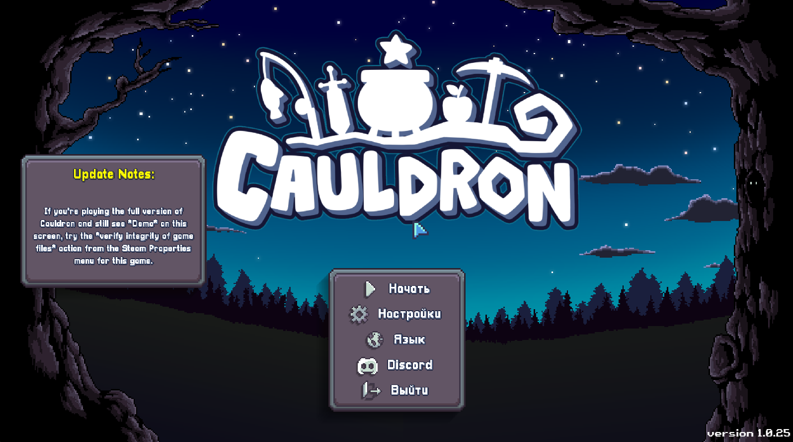
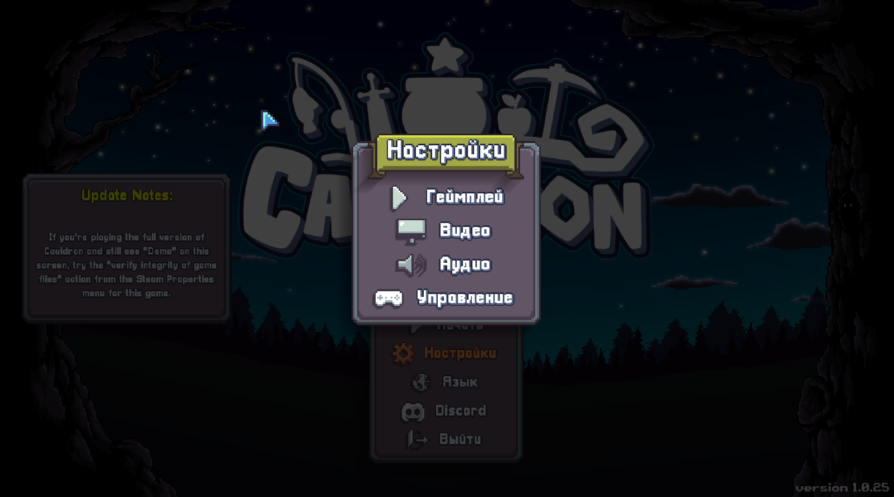
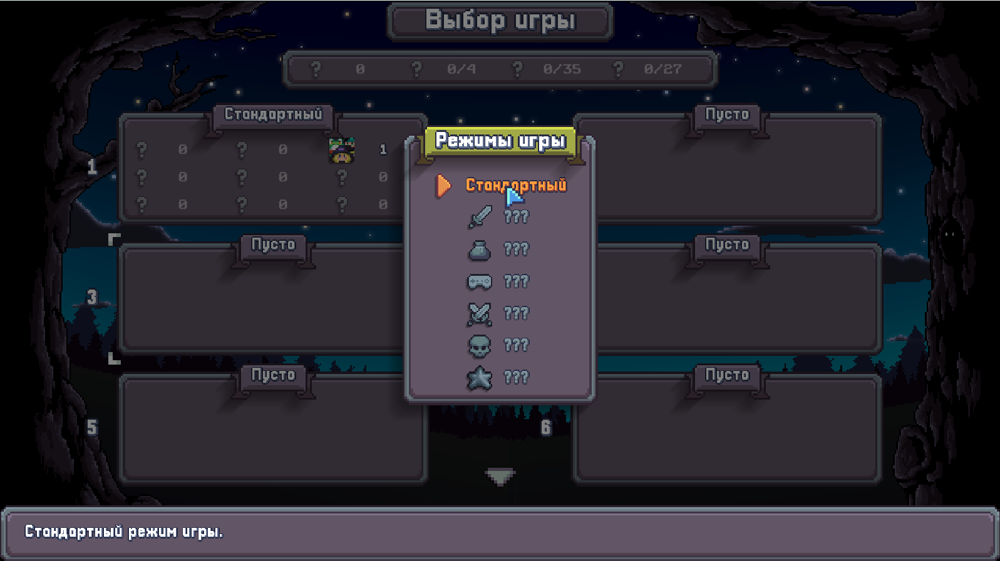
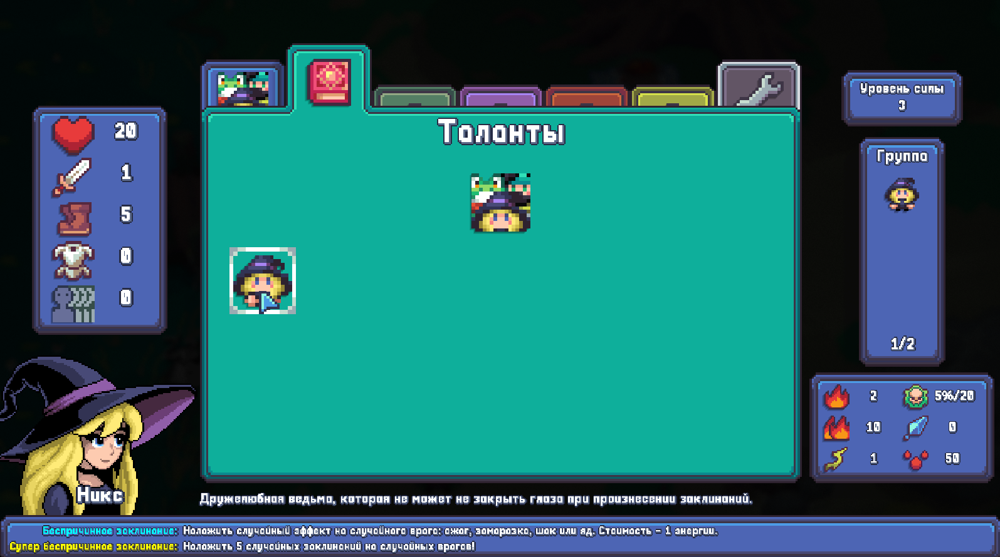

# Cauldron Game Russian Localization 🇷🇺

[RU](README.md) | **EN**

## Project Description
Complete Russian localization of the **Cauldron** game with Cyrillic support. The project includes interface translation to Russian and replacement of all game fonts with versions supporting Cyrillic characters.

## 🎯 Project Goals
- Add Russian language support to the game
- Solve the Cyrillic display issue (instead of empty strings)
- Replace Chinese language with Russian in the game menu

## 📁 File Structure

### Language Files:
- `Simplified_Chinese.txt` - replaced with Russian translation

### Fonts (replaced with PixCyrillic):
- `AlimamaFangYuanTiVF-Thin-2.ttf` - Chinese font

### Backup Files:
All original files are saved with `.backup` extension

## 🔧 Technical Implementation
### Stage 1: Finding Suitable Font
- **Selected Font**: PixCyrillic
- **Source**: https://github.com/lotva/pix-cyrillic
- **Advantages**:
  - Pixel style suitable for the game
  - Full support for Russian, Ukrainian and Belarusian Cyrillic
  - Small file size (35KB)
  - Free license

### Stage 2: Language File and Font Replacement
# Copy files from archive to game folder with replacement

## 🎮 Usage Instructions

### Activating Russian Language:
1. Launch `Cauldron.exe`
2. Open **Settings** menu
3. Go to **Language** section
4. Select **Chinese/中文** (now this is Russian language)
5. Enjoy the game in Russian!

### Restoring Original Files:
```powershell
# If you need to restore original fonts
copy min.ttf.backup min.ttf
copy submin.ttf.backup submin.ttf
copy orthogonal.ttf.backup orthogonal.ttf
copy "Retro Gaming.ttf.backup" "Retro Gaming.ttf"
copy careless-script.ttf.backup careless-script.ttf
copy AlimamaFangYuanTiVF-Thin-2.ttf.backup AlimamaFangYuanTiVF-Thin-2.ttf
```

## 📝 Notes

### Translation Features:
- All game terms and special characters preserved (#, %, x)
- Long strings adapted for Russian language
- Original text styling maintained

### Known Limitations:
- Russian language is only available through "Chinese" menu item
- Re-installation may be required after game updates

### Compatibility:
- ✅ Steam version of the game
- ✅ All game modes
- ✅ Full functionality

## 🏆 Results

After applying the Russian localization:
- ✅ Cyrillic support
- ✅ Complete interface translation
- ✅ Original style preservation
- ✅ Stable game operation
- ✅ Ability to rollback to original

## 📸 Screenshots






## 📞 Support

If you encounter issues:
1. Check that all files are replaced correctly
2. Make sure the correct language is selected in settings
3. If necessary, restore original files from backups

---

**Localization Version**: 0.1
**Creation Date**: July 12, 2025  
**Compatibility**: Cauldron (Steam)  
**Status**: Ready to use ✅ 
